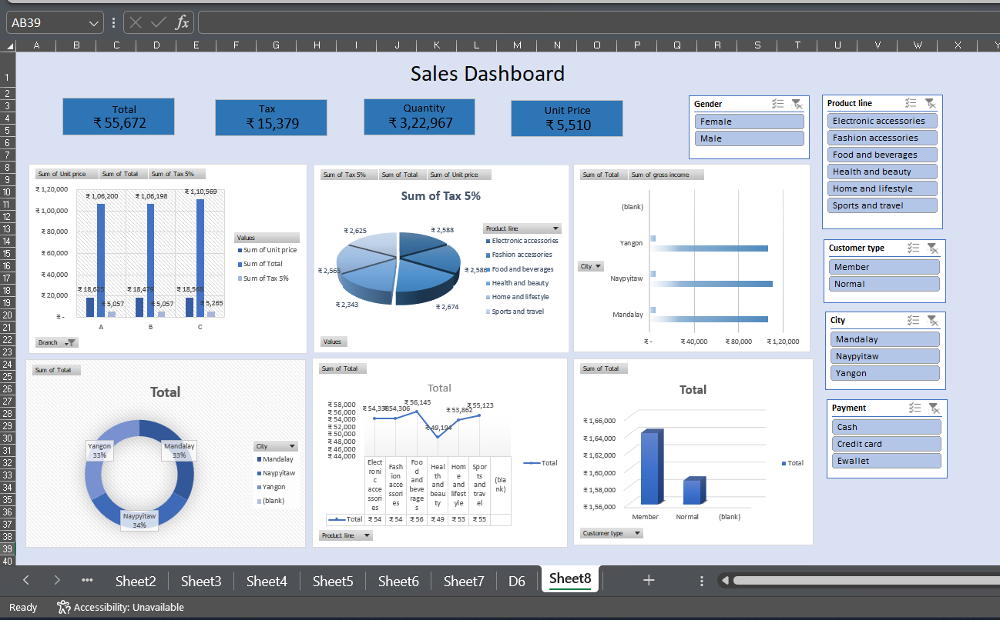

# 📊 Sales Data Analytics Dashboard

## 📌 Project Overview
This project focuses on analyzing sales data and presenting insights through an Excel-based dashboard.  
A dataset containing 1000 sales records was used to evaluate sales performance, customer behavior, and product trends.

The final dashboard output is shared as an image for visualization reference.

---

## 🗂 Dataset Information
- Total Records: 1000
- File Format: CSV
- Key Columns:
  - Invoice ID
  - Branch
  - City
  - Customer Type
  - Gender
  - Product Line
  - Unit Price
  - Quantity
  - Tax (5%)
  - Total
  - Payment Method
  - Gross Income
  - Rating

---

## 📈 Dashboard Highlights
The dashboard provides insights on:
- Total Sales Revenue
- Total Tax Collected
- Total Quantity Sold
- Average Unit Price
- Sales analysis by:
  - Product Line
  - City
  - Customer Type
  - Gender
  - Payment Method

Interactive filters (slicers) enable dynamic analysis of sales data.

---

## 🛠 Tools & Techniques Used
- Microsoft Excel
- Pivot Tables
- Pivot Charts
- Slicers
- Data Cleaning & Aggregation

---

## 📷 Final Dashboard Output

---

## 🎯 Key Insights
- Member customers contribute higher sales compared to normal customers
- Certain product categories show consistently strong performance
- Sales distribution across cities is fairly balanced
- Digital payment methods such as E-wallet and Credit Card are widely used

---

## 📌 Conclusion
This project demonstrates hands-on experience in data analytics, dashboard creation, and deriving business insights using Excel.

---

## 👩‍💻 Author
**Keerthana M**  
B.Tech – Artificial Intelligence & Data Science  
Aspiring Data Analyst / AI Engineer
